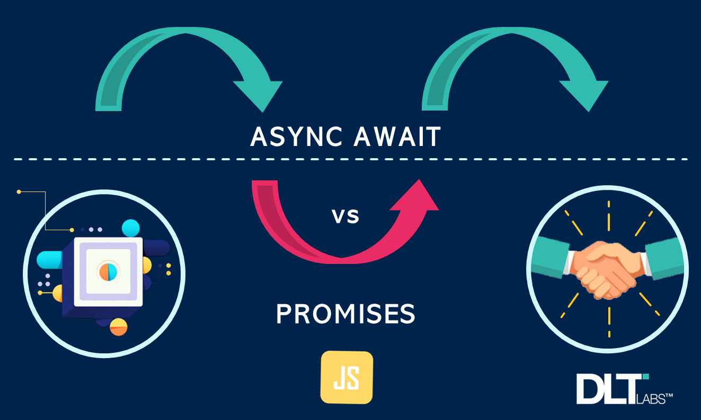
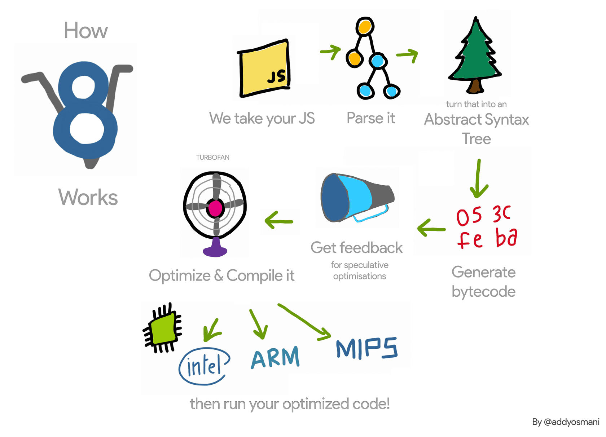

import Attribution from 'components/Attribution'




<Attribution
  name="DLT Labs"
  url="https://blog.devgenius.io/how-do-differences-in-promise-chains-and-async-await-affect-your-code-logic-b85aeb566ebb"
/>

import GifPlayer from 'components/GifPlayer'

## 1. Asynchronous Overview

### 1.1. Single thread vs Multi thread

|                                   | Single Thread | Multi Thread |
| --------------------------------- | ------------- | ------------ |
| How many task performed at a time | One           | Many         |
| Resource sharing                  | No            | Yes          |

**Javscript** is a **single thread** programming language.

### 1.2. Sync vs Async


## 2. setTimeout()


### 2.1. setTimeout overview

- **What**: a global method to set a timer, then **exec a function** when the **timer is expired**.
- **When**: you want to run a function after period time.
- **Where**: working both browser and nodejs.

```javascript
const timeoutId = setTimeout(callback, timeout)
// callback is the function will be executed once the timer is expired // timeout is the time in milliseconds, default to 0. 1 second = 1000 milliseconds
// timeoutId is a positive integer, used to identify a timeout
// and clear it by using clearTimeout(timeoutId)
```

### 2.2. clearTimeout

```javascript
const timeoutId = setTimeout(() => {
  console.log('Tada!!!')
}, 5000)
clearTimeout(timeoutId) // cancel the timeout // should be called before the timeout expired
```

### 2.3. Late timeout

The timeout can also fire later than expected if the page (or the OS/browser) is busy with other tasks.

```javascript
setTimeout(() => {
  console.log('Tada!!!')
})
let count = 1
for (let i = 0; i < 1e9; i++) {
  count++
}
console.log('Done')
```

Source:

- https://dev.to/lydiahallie/javascript-visualized-event-loop-3dif
- https://dev.to/lydiahallie/javascript-visualized-promises-async-await-5gke

## 3. debounce

### 3.1. How it works

- debounce exec function after period of time receiving no trigger

### 3.2. Simple implementation

```javascript
function debounce(callback, wait) {
  let timeoutId
  return function () {
    if (timeoutId) {
      clearTimeout(timeoutId)
    }
    timeoutId = setTimeout(callback, wait)
  }
}
```

Use case for debounce: https://codepen.io/tutsplus/pen/VwPoQpR

## 4. Throttle

### 4.1. How it works

- throttle trigger max 1 call every period time.

### 4.2. Simple implementation

```javascript
function throttle(callback, wait) {
  let isThrottling = false;
return function () {
if (isThrottling) return; // 2, 3, 4 come here
isThrottling = true; // 1 come here setTimeout(() => {
callback();
      isThrottling = false;
    }, wait);
}; }
```

Use case for throttle: https://codepen.io/tutsplus/pen/yLgmvbX

## 5. setInterval(callback, delay)

### 5.1. setInterval overview

- **What**: exec callback every period of time until it's cleared by clearInterval.
- **When**: do something repeatly.
- **Where**: working both browser and nodejs.

```javascript
const timeoutId = setTimeout(callback, timeout)
// callback is the function will be executed once the timer is expired // timeout is the time in milliseconds, default to 0. 1 second = 1000 milliseconds
// timeoutId is a positive integer, used to identify a timeout
// and clear it by using clearTimeout(timeoutId)
```

### 5.2. clearInterval

```javascript
const intervalId = setInterval(() => {
  console.log('Hey, are you there?')
}, 2000)
clearInterval(intervalId)
```

> NOTE: `setInterval()` and `setTimeout()` share the same pool of IDs.

### 5.3. Example with countdown

```javascript
function countdown(seconds) {
  let currentSecond = seconds
  const intervalId = setInterval(() => {
    console.log(currentSecond)
    if (currentSecond <= 0) {
      clearInterval(intervalId)
    }
    currentSecond -= 1
  }, 1000)
}
countdown(10)
```

## 6. Event loop

### 6.1. Javascript engine



Source: https://dzone.com/articles/v8-javascript-engine-the-non-stop-improvement

| #   | Name                        | Description                                                |
| --- | --------------------------- | ---------------------------------------------------------- |
| 1   | Javascript Engine           | computer program that exec js code                         |
| 2   | ECMAScript Engine           | computer program that exec code that implements ECMAScript |
| 3   | Compiler                    | AoT (Ahead of Time), compile all --> exec                  |
| 4   | Interpreter                 | line by line, read and exec                                |
| 5   | Just-in-time (JIT) compiler | use the best of Compiler + Interpreter (modern browsers)   |

Source: https://hacks.mozilla.org/2017/02/a-crash-course-in-just-in-time-jit-compilers/

##### ECMAScript engines

| #   | Name           | Engine                  |
| --- | -------------- | ----------------------- |
| 1   | Chrome         | V8 - Google open source |
| 2   | NodeJS         | V8                      |
| 3   | Microsoft Edge | V8                      |
| 4   | Firefox        | Spider Monkey           |
| 5   | Safari         | JavascriptCore          |

Source: https://en.wikipedia.org/wiki/List_of_ECMAScript_engines

### 6.2. Event loop components


| #   | Name           | Description                                                                                      |
| --- | -------------- | ------------------------------------------------------------------------------------------------ |
| 1   | Heap           | where to store objects and functions                                                             |
| 2   | Call Stack     | keep track of the functions that a script calls                                                  |
| 3   | Web API        | APIs of web browsers to help you make AJAX request, DOM manipulation, do things concurrently,... |
| 4   | Callback Queue | run code after the execution of the Web API call has finished                                    |
| 5   | Event Loop     | run-to-complete, add call from Queue when the call stack is empty.                               |

> Maximum call stack size exceeded from 10k to 50k

Source:

- https://dev.to/lydiahallie/javascript-visualized-event-loop-3dif
- https://felixgerschau.com/javascript-event-loop-call-stack/

##### Callback Queue vs Promise Queue (Macrotask vs Microtask)

- Promise Queue has higher priority than callback queue.
- Or we can say: microtask has higher priority than macrotask.

```javascript
console.log('a')
setTimeout(() => console.log('b'), 0)
new Promise((resolve, reject) => {
  resolve()
}).then(() => {
  console.log('c')
})
console.log('d')
// a -> d -> c -> b
```

## 7. AJAX - Asynchronous Javascript and XML

### 7.1. AJAX overview


AJAX is made up of the following technologies:

- XHTML and CSS for presenting information.
- Document Object Model (DOM) for dynamically interacting with and displaying the presented information.
- XMLHttpRequest object to manipulate data asynchronously with the web server.
- XML, HTML, and XSLT for data interchange and manipulation.

### 7.2. HTTP APIs

An HTTP API is an API that uses **Hypertext Transfer Protocol** as the communication protocal **between the two systems.**

| #   | Name                    | Description                                                                          |
| --- | ----------------------- | ------------------------------------------------------------------------------------ |
| 1   | REST API (most popular) | Representational State Transfer is an architectural patten for creating web services |
| 2   | GraphQL API             | GraphQL API allows requests to call for the exact amount of data and type it needs   |

### 7.3. XMLHttpRequest

```javascript
const url = 'http://js-post-api.herokuapp.com/api/students?_page=1'
const xhr = new XMLHttpRequest()
xhr.open('GET', url)
xhr.responseType = 'json'
xhr.addEventListener('load', function () {
  console.log(xhr.response)
})
xhr.addEventListener('error', function () {
  console.log('Something wrong :P')
})
xhr.send()
```

Source: https://developer.mozilla.org/en-US/docs/Web/API/XMLHttpRequest

## 8. Promise

Source: https://www.freecodecamp.org/news/learn-promise-async-await-in-20-minutes/

### 8.1. Callback hell
### 8.2. Promise overview
### 8.3. Promise methods
### 8.4. Promise chaining
### 8.5 Fake API


Updating...
