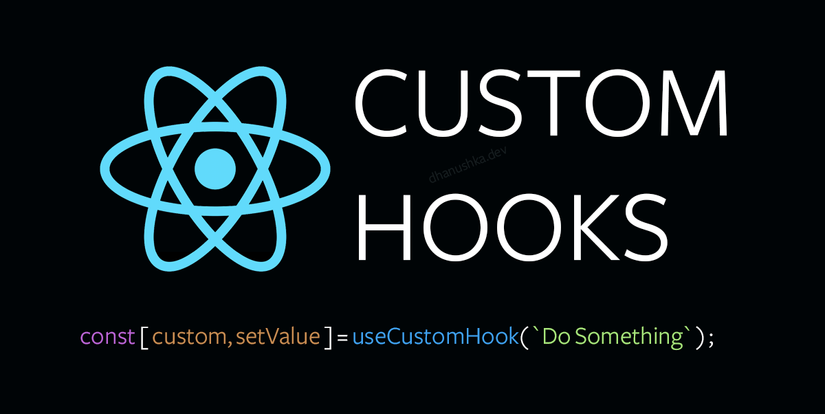

import Attribution from 'components/Attribution'



<Attribution name="React" url="https://reactjs.org/" />

Custom Hooks là một công cụ thực sự cần thiết cho phép bạn custom một funtional đặc biệt. 

Trong nhiều trường hợp, nếu bạn muốn thêm một tính năng nhất định vào app của mình, bạn chỉ cần cài đặt một third-party library để giải quyết vấn đề. Nhưng nếu một library hoặc hook như vậy không tồn tại, bạn sẽ làm gì?

Thông thường những Component sẽ trả về 1 UI để render lên màn hình. Đó chính là Component bình thường. Nếu bạn muốn một Component trả về logic data nhưng vẫn muốn sử dụng lifecycle hay các hàm của hooks. Đó là Custom Hooks. Sau đây, chúng ta cùng nhau tìm hiểu cách để tạo nên một Custom Hooks nhé!

## 1. useCopyToClipboard Hook

Có rất nhiều tư viện hỗ trợ chúng ta copy một đoạn text vào clipboard. Ví dụ như thư viện [copy-to-clipboard](https://www.npmjs.com/package/react-copy-to-clipboard) này. Mình dùng cái này, tại mọi người tải nhiều vãi :))

Đầu tiên, khởi tạo hàm `useCopyToClipboard`
```javascript
// utils/useCopyToClipboard.js
import React from "react";
import copy from "copy-to-clipboard";

export default function useCopyToClipboard() {}
```

Xử lý logic copy bằng `handlCopy` function
```javascript {6}
import React from "react";
import copy from "copy-to-clipboard";

export default function useCopyToClipboard() {
  function handleCopy(text) {
    if (typeof text === "string" || typeof text == "number") {
      copy(text.toString());
    } else {
      console.error(
        `Cannot copy typeof ${typeof text} to clipboard, must be a string or number.`
      );
    }
  }

  return handleCopy;
}
```

Cuối cùng, chúng ta sẽ check xem text đã được copied hay chưa bằng cách sử dụng `useState`.
```javascript {5,10,12}
import React from "react";
import copy from "copy-to-clipboard";

export default function useCopyToClipboard(resetInterval = null) {
  const [isCopied, setCopied] = React.useState(false);

  function handleCopy(text) {
    if (typeof text === "string" || typeof text == "number") {
      copy(text.toString());
      setCopied(true);
    } else {
      setCopied(false);
      console.error(
        `Cannot copy typeof ${typeof text} to clipboard, must be a string or number.`
      );
    }
  }

  return [isCopied, handleCopy];
}
```

Nếu muốn reset state vài giây sau khi chúng ta thực hiện việc copy. Chúng ta phải improve đoạn code trên thêm một xíu.
Chúng ta sẽ sử dụng `setTimeout` để làm việc này. Lưu ý cần phải clear timeout sau mỗi lần unmount.
```javascript {7,19-27}
import React from "react";
import copy from "copy-to-clipboard";

export default function useCopyToClipboard(resetInterval = null) {
  const [isCopied, setCopied] = React.useState(false);

  const handleCopy = React.useCallback((text) => {
    if (typeof text === "string" || typeof text == "number") {
      copy(text.toString());
      setCopied(true);
    } else {
      setCopied(false);
      console.error(
        `Cannot copy typeof ${typeof text} to clipboard, must be a string or number.`
      );
    }
  }, []);

  React.useEffect(() => {
    let timeout;
    if (isCopied && resetInterval) {
      timeout = setTimeout(() => setCopied(false), resetInterval);
    }
    return () => {
      clearTimeout(timeout);
    };
  }, [isCopied, resetInterval]);

  return [isCopied, handleCopy];
}
```
Cuối cùng, chúng ta wrap `handleCopy` trong `useCallback` để đảm bảo hàm này không tạo lại sau mỗi lần rerender.

### Sử dụng useCopyToClipboard như thế nào?
```javascript
import React from "react";
import ClipboardIcon from "../svg/ClipboardIcon";
import SuccessIcon from "../svg/SuccessIcon";
import useCopyToClipboard from "../utils/useCopyToClipboard";

function CopyButton({ code }) {
  // isCopied sẽ bị reset sau 3 giây
	// Để trống tham số truyền vào useCopyToClipboard thì isCopied sẽ không bị reset
  const [isCopied, handleCopy] = useCopyToClipboard(3000);

  return (
    <button onClick={() => handleCopy(code)}>
      {isCopied ? <SuccessIcon /> : <ClipboardIcon />}
    </button>
  );
}
```

## 2. usePageBottom Hook
Đôi khi, chúng ta cần biết khi nào người dùng cuộn đến cuối trang. Ví dụ như Instagram, chúng ta cần load thêm bài viết khi đến cuối trang.

```javascript
import React from "react";

export default function usePageBottom() {
  const [bottom, setBottom] = React.useState(false);

  React.useEffect(() => {
    function handleScroll() {
      const isBottom =
        window.innerHeight + document.documentElement.scrollTop 
        === document.documentElement.offsetHeight;
      setBottom(isButton);
    }
    window.addEventListener("scroll", handleScroll);
    return () => {
      window.removeEventListener("scroll", handleScroll);
    };
  }, []);

  return bottom;
}

```


## 3. useWindowSize
```javascript
import React from "react";

export default function useWindowSize() {
  const isSSR = typeof window !== "undefined";
  const [windowSize, setWindowSize] = React.useState({
    width: isSSR ? 1200 : window.innerWidth,
    height: isSSR ? 800 : window.innerHeight,
  });

  function changeWindowSize() {
    setWindowSize({ width: window.innerWidth, height: window.innerHeight });
  }

  React.useEffect(() => {
    window.addEventListener("resize", changeWindowSize);

    return () => {
      window.removeEventListener("resize", changeWindowSize);
    };
  }, []);

  return windowSize;
}
```
### Sử dụng useWindowSize như thế nào?
```javascript
// components/StickyHeader.js

import React from "react";
import useWindowSize from "../utils/useWindowSize";

function StickyHeader() {
  const { width } = useWindowSize();

  return (
    <div>
      {/* visible only when window greater than 500px */}
      {width > 500 && (
        <>
          <div onClick={onTestimonialsClick} role="button">
            <span>Testimonials</span>
          </div>
          <div onClick={onPriceClick} role="button">
            <span>Price</span>
          </div>
          <div>
            <span onClick={onQuestionClick} role="button">
              Question?
            </span>
          </div>
        </>
      )}
      {/* visible at any window size */}
      <div>
        <span className="primary-button" onClick={onPriceClick} role="button">
          Join Now
        </span>
      </div>
    </div>
  );
}
```

## 4. useDeviceDetect Hook
```javascript
// utils/useDeviceDetect.js
import React from "react";

export default function useDeviceDetect() {
  const [isMobile, setMobile] = React.useState(false);

  React.useEffect(() => {
    const userAgent =
      typeof window.navigator === "undefined" ? "" : navigator.userAgent;
    const mobile = Boolean(
      userAgent.match(
        /Android|BlackBerry|iPhone|iPad|iPod|Opera Mini|IEMobile|WPDesktop/i
      )
    );
    setMobile(mobile);
  }, []);

  return { isMobile };
}
```
### Sử dụng useDeviceDetect như thế nào?
```javascript
// templates/course.js
import React from "react";
import useDeviceDetect from "../utils/useDeviceDetect";

function Course() {
  const { isMobile } = useDeviceDetect();

  return (
    <>
      <SEO />
      {!isMobile && <StickyHeader {...courseData} />}
      {/* more components... */}
    </>
  );
}
```

## Kết luận
Trên đây là cách để custom một hook đơn giản và một vài hook thường hay sử dụng. Hi vọng trong bài viết này mình mang lại một số kiến thức bổ ích cho mọi người.

Link tham khảo: https://www.freecodecamp.org/news/how-to-create-react-hooks/