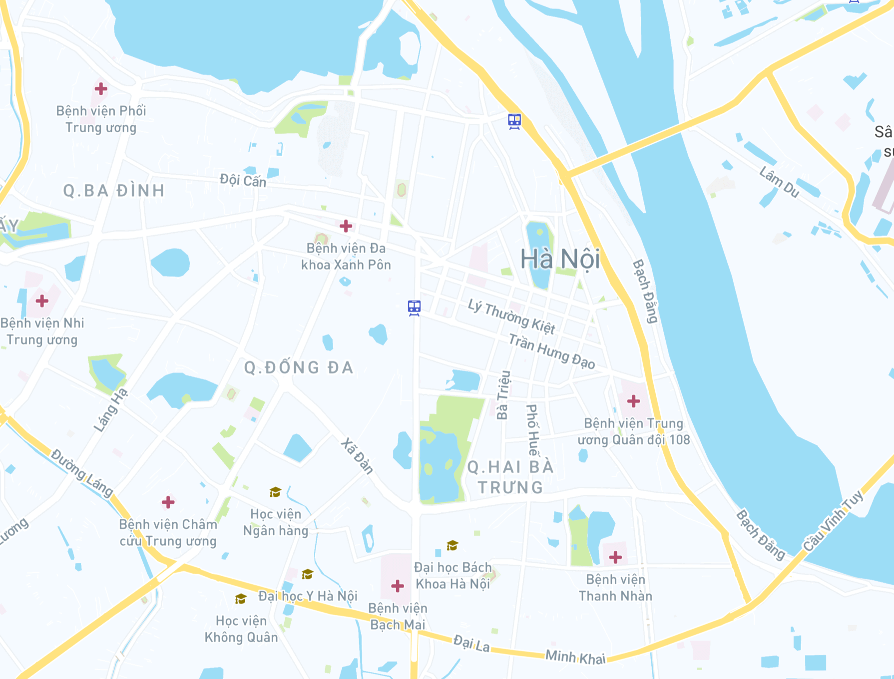

import Attribution from 'components/Attribution'

<Attribution name="goong.io" url="https://goong.io/" />

## Goong là gì?
[Goong Maps](https://goong.io/) là nền tảng cung cấp Maps API với chất lượng tương đương Google Maps APIs tại Việt Nam

## Lý do thay thế Google Map?
- Google Maps hiện nay đã chặn thanh toán từ Việt Nam, bạn sẽ không thể dùng billing account từ Việt Nam để sử dụng Maps APIs của Google
- Place API bị giảm xuống còn 2400 request / ngày.
- Direction API bị giảm xuống còn 1400 request / ngày.
- Nhiều API khác như Map API cho web, API liên quan tới Google Map,... đều bị limit

## Goong
- Tích hợp vào hệ thống rất đơn giản, chỉ cần thay đổi end-point-URL và key. Các format gọi lên và trả về đều giống với Google Maps
- Goong Maps sở hữu kho dữ liệu phong phú và được cập nhật liên tục trên khắp các tỉnh thành Việt Nam. Hệ thống dữ liệu này hoàn toàn do Goong tự xây dựng và cập nhật.
- Chất lượng APIs của Goong tương đương Google Maps APIs
- Goong không chỉ có chi phí hợp lý hơn (chỉ bằng 50%) google maps, mà còn cung cấp hỗ trợ kỹ thuật 24/7
- Goong cung cấp đầy đủ các API và libraries giúp developer dễ dàng tích hợp
  - Directions API
  - Distance Matrix API
  - Geocoding API
  -Places Autocomplete API
  -Static Map API
  -Javascript, Native, React libraries
-Tốc độ cao: ở chế độ miễn phí, Goong hỗ trợ 600 requests/phút. Các khách hàng trả tiền được hỗ trợ từ 1200 - 30,000+ request/phút.
- Dữ liệu bản đồ bao gồm toàn bộ địa giới Việt Nam phủ khắp 63 tỉnh thành, gồm dữ liệu POIs của nhiều danh mục khác nhau và toàn bộ kho dữ liệu được cập nhật và kiểm tra liên tục.
- Goong được tin tưởng bởi các đối tác lớn: Be Group, Ahamove, iCheck... và rất nhiều các đối tác khác.

Hi vọng bài viết này sẽ giúp cho những bạn có project đang gặp vấn đề về Google Maps API sẽ có được cách giải quyết!

Link bài viết: https://viblo.asia/p/goong-maps-giai-phap-thay-the-google-map-api-tai-viet-nam-07LKXLdeKV4